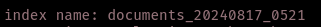

# Ingestion Pipeline

## Q1. Running Mage

**What's the version of mage?**

*Answer*: 0.9.72*

## Q2. Reading the documents

**Copy the code to the editor How many FAQ documents we processed?**

*Answer:* 1

## Q3. Chunking

**How many documents (chunks) do we have in the output?**

*Answer:* 86

## Q4. Export

**What's the last document id?**

*Answer:* fa136280

## Q5. Testing the retrieval

**What's the ID of the top matching result?**

*Answer:*

## Q6. Reindexing

**What's the ID of the top matching result?**

*Answer:*

