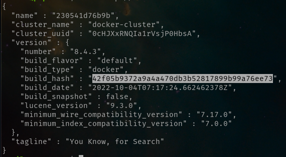

## Introduction

### Q1. Running Elastic

**What's the version.build_hash?**

*Answer*: 42f05b9372a9a4a470db3b52817899b99a76ee73

### Q2. Indexing the data

**Which function do you use for adding your data to elastic?**

*Answer*: index

### Q3. Searching

**What's the score for the top ranking result?**

*Answer*: 84.05

### Q4. Filtering

**Return 3 results. What's the 3rd question returned by the search engine?**

*Answer*: How do I copy files from a different folder into docker container’s working directory?

### Q5. Building a prompt

*Answer:* 1462

### Q6. Tokens

*Answer:* 322